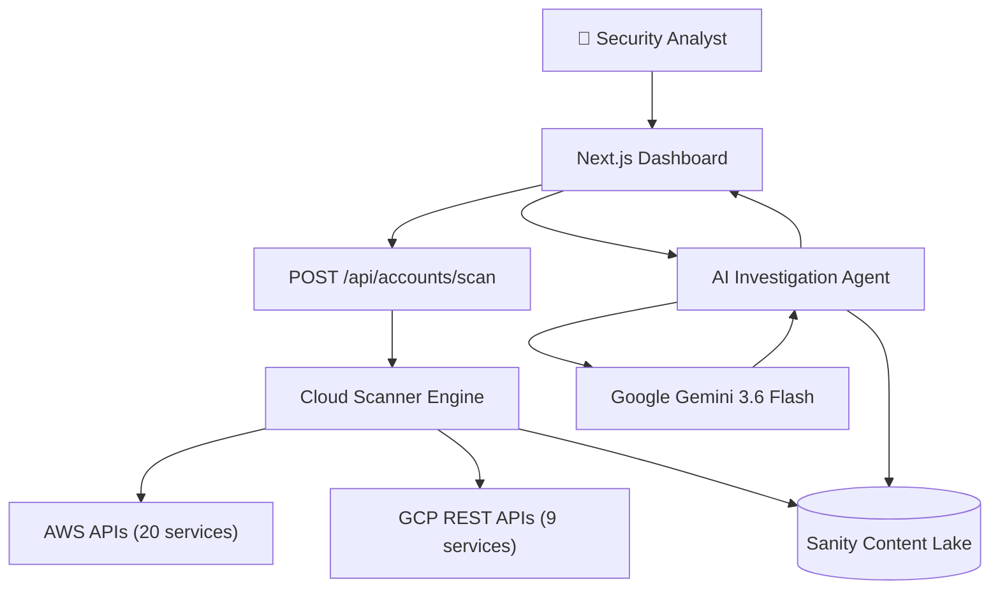

# TraceGuard 🛡️


**Open-source cloud security investigation platform with AI-powered threat analysis, 29 cloud service scanners, and automated remediation guidance.**

---

## ✨ Features

- **🔍 AI-Powered Investigation:** 15-step Gemini pipeline using Google Gemini 3.6 Flash and `generateObject()` with Zod schemas for structured analysis.
- **☁️ Full Cloud Scanning:** Comprehensive scanning across 20 AWS services and 9 GCP services.
- **🛡️ Compliance Coverage:** Built-in mapping for CIS AWS/GCP, NIST CSF, PCI DSS 4.0, SOC 2 Type II, ISO 27001, HIPAA, and MITRE ATT&CK Cloud.
- **🔐 Secure Credential Storage:** AES-256-GCM encryption guarantees that cloud credentials are never stored in plaintext within the database.
- **📊 Real-time Scan Progress:** Chunked scanning architecture ensures reliable execution even on the Vercel free tier (10s execution limit).
- **🎯 Actionable Remediation:** Receive CLI commands, Terraform snippets, and direct console URLs tailored to each finding.
- **📡 Sanity CMS:** A structured security knowledge base using Sanity as both a CMS and a database.
- **🌊 SSE Streaming:** Real-time feedback with Server-Sent Events streaming token-by-token during investigation runs.

---

## 🏗️ Architecture



---

## 🛠️ Tech Stack

| Technology | Version | Purpose |
| :--- | :--- | :--- |
| **Next.js** | 16.3.5 | App Router, API endpoints, Server Components |
| **React** | 19 | UI components and hooks |
| **TypeScript** | 5.x | Type safety across the stack |
| **Sanity** | v6 | Database, CMS, and Knowledge Base |
| **Vercel AI SDK** | v7 | Orchestrating AI models and structured outputs |
| **Google Gemini** | 3.6 Flash | LLM for the 15-step investigation pipeline |
| **AWS SDK** | v3 | Scanning AWS cloud resources (21 packages) |
| **GCP REST APIs**| Native | Native JWT auth for scanning GCP |

---

## 🚀 Quick Start

### Prerequisites
- **Node.js**: v20+
- **Sanity Account**: A Sanity project (free tier is sufficient)
- **Cloud Credentials**: Read-only AWS IAM User/Role or GCP Service Account

### Installation

1. **Clone the repository:**
   ```bash
   git clone https://github.com/your-org/TraceGuard.git
   cd TraceGuard
   ```

2. **Install dependencies:**
   ```bash
   npm install
   ```

3. **Set up environment variables:**
   Copy the example environment file and fill in your values.
   ```bash
   cp .env.example .env.local
   ```

4. **Seed Sanity Database:**
   ```bash
   npm run seed
   ```

5. **Run the development server:**
   ```bash
   npm run dev
   ```

6. **Open Dashboard:** Visit [http://localhost:3000](http://localhost:3000)

---

## ⚙️ Environment Variables

| Variable | Description | Required |
| :--- | :--- | :--- |
| `NEXT_PUBLIC_SANITY_PROJECT_ID` | Sanity Project ID | Yes |
| `NEXT_PUBLIC_SANITY_DATASET` | Sanity Dataset (e.g., `production`) | Yes |
| `SANITY_API_TOKEN` | Read/write token for Sanity | Yes |
| `ENCRYPTION_KEY` | 32-byte base64 string for AES-256-GCM | Yes |
| `GOOGLE_GENERATIVE_AI_API_KEY` | API Key for Gemini 3.6 Flash | Yes |

---

## ☁️ Cloud Permissions

### AWS Minimum Permissions
Create an IAM Policy with `ReadOnlyAccess` or the specific list of read actions required by the 20 AWS services scanned.
```json
{
  "Version": "2012-10-17",
  "Statement": [
    {
      "Effect": "Allow",
      "Action": [
        "s3:Get*",
        "s3:List*",
        "iam:Get*",
        "iam:List*",
        "ec2:Describe*",
        "rds:Describe*",
        "lambda:List*",
        "eks:Describe*",
        "cloudtrail:DescribeTrails",
        "kms:List*",
        "kms:Describe*"
      ],
      "Resource": "*"
    }
  ]
}
```

### GCP Minimum Permissions
Assign the following roles to your GCP Service Account:
- `roles/viewer` (Basic read-only access)
- Additional specific read roles if granular scoping is preferred.

---

## 📂 Project Structure

```text
TraceGuard/
├── app/
│   ├── (dashboard)/        # Next.js UI Pages
│   └── api/                # API routes
├── components/             # Reusable React components
├── data/
│   └── seed.ts             # Sanity seed script
├── lib/
│   ├── agent/
│   │   └── investigationAgent.ts # 15-step AI pipeline
│   ├── sanity/
│   │   └── queries.ts      # GROQ queries
│   └── scanners/
│       ├── aws/            # AWS service scanners (20 files)
│       ├── gcp/            # GCP service scanners (9 files)
│       ├── rules/          # Compliance mapping rules
│       ├── credentials.ts  # Crypto utilities
│       ├── engine.ts       # Chunked scan orchestrator
│       └── types.ts        # Core types
├── sanity/
│   └── schemas/            # 11 Sanity DB schemas
└── README.md
```

---

<details>
<summary><b>🛠️ AWS Services Scanned (20)</b></summary>

| Service | Checks Performed | Severity |
| :--- | :--- | :--- |
| **S3** | Public access, encryption, versioning, logging | High-Critical |
| **IAM** | MFA, key rotation, inactive users, root usage | Critical |
| **EC2** | Open security groups, IMDSv2, EBS encryption | High |
| **VPC** | Flow logs, default VPC usage, NACLs | Medium-High |
| **RDS** | Public instances, encryption, auto-minor upgrades | High |
| **Lambda** | Public access, old runtimes, tracing | Medium |
| **EKS** | Endpoint access, secrets encryption, logging | High |
| **CloudTrail** | Multi-region trails, log validation | High |
| **KMS** | Key rotation, exposed policies | Critical |
| **Secrets Manager** | Rotation enabled, unused secrets | Medium-High |
| **ACM** | Expiring certificates, validation status | Medium |
| **DynamoDB** | PITR, encryption, network isolation | High |
| **SQS** | Server-side encryption, public access | Medium |
| **SNS** | Server-side encryption, public access | Medium |
| **CloudFront** | WAF association, HTTPS enforcement | Medium-High |
| **GuardDuty** | Enabled status, active findings | High |
| **Security Hub** | Enabled status, active findings | High |
| **AWS Config** | Recorder status, global resources | Medium |
| **Redshift** | Public access, encryption, auditing | High |
| **OpenSearch** | Encryption at rest, node-to-node encryption | High |

</details>

<details>
<summary><b>🛠️ GCP Services Scanned (9)</b></summary>

| Service | Checks Performed | Severity |
| :--- | :--- | :--- |
| **Cloud Storage** | Public access prevention, uniform bucket-level access | High-Critical |
| **IAM** | Service account keys, overly permissive bindings | Critical |
| **Compute Engine** | Shielded VMs, OS Login, external IPs | High |
| **Cloud SQL** | Public IP, authorized networks, backups | High |
| **BigQuery** | Public datasets, customer-managed encryption keys | High |
| **Cloud Functions** | Allow unauthenticated, runtime versions | Medium-High |
| **GKE** | Network policies, binary authorization, private clusters | High |
| **Cloud KMS** | Rotation periods, exposed keys | Critical |
| **Cloud Logging** | Audit log sinks, retention policies | Medium |

</details>

---

## 📜 Compliance Coverage

| Framework | Version | Mapping |
| :--- | :--- | :--- |
| **CIS AWS Foundations** | v3.0 | Mapped via `lib/scanners/rules/aws.ts` |
| **CIS GCP** | v2.0 | Mapped via `lib/scanners/rules/gcp.ts` |
| **NIST CSF** | v2.0 | Identify, Protect, Detect, Respond, Recover |
| **PCI DSS** | 4.0 | Network security, data encryption, IAM controls |
| **SOC 2 Type II** | 2017 | Security, Availability, Confidentiality principles |
| **ISO 27001** | 2022 | Annex A controls mapping |
| **HIPAA** | Security Rule | Access controls, audit controls, integrity |
| **MITRE ATT&CK** | Cloud Matrix | Initial Access, Persistence, Privilege Escalation |

---

## 🔌 API Reference

| Route | Method | Description |
| :--- | :--- | :--- |
| `/api/accounts/scan` | `POST` | Initiates chunked scan for a cloud account |
| `/api/investigation/run` | `POST` | Triggers 15-step AI investigation pipeline |
| `/api/investigation/stream` | `GET` | SSE endpoint for live AI reasoning stream |
| `/api/findings` | `GET` | Fetches aggregated scan findings |
| `/api/credentials/validate` | `POST` | Validates IAM/GCP credentials before saving |

---

## 🚢 Deployment

### Vercel (Recommended)
TraceGuard's chunked scanning architecture is specifically designed to work within Vercel's free tier (10s serverless function limit).

1. Connect your GitHub repository to Vercel.
2. Add all environment variables in the Vercel project settings.
3. Deploy!

### Self-Hosted (Node 20+)
```bash
npm run build
npm start
```
*Note: Ensure your hosting environment supports Server-Sent Events (SSE) for the AI investigation streaming to work properly.*

---

## 🤝 Contributing
Contributions are welcome! Please read our [Contributing Guide](CONTRIBUTING.md) to get started.

## 📄 License
This project is licensed under the [MIT License](LICENSE).

## 🔒 Security
If you discover a security vulnerability within TraceGuard, please send an e-mail to security@traceguard.com. We practice responsible disclosure.
