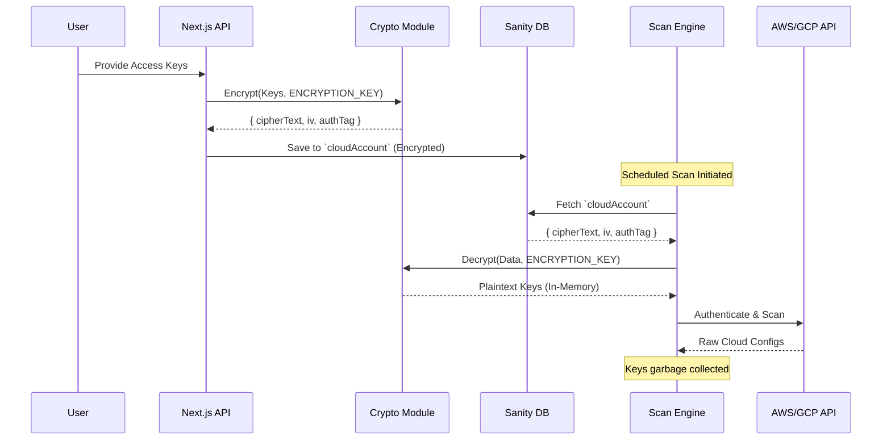

# TraceGuard Architecture

This document provides an in-depth look at TraceGuard's underlying architecture, from data modeling to AI orchestration and scanning mechanisms.

---

## 1. System Overview

TraceGuard is a cloud security investigation platform built on Next.js 16.3.5 and React 19. It leverages Sanity v6 as both a CMS and the primary database. The application orchestrates automated scanning of cloud environments (AWS and GCP) using a chunked execution model and employs an advanced 15-step AI pipeline (powered by Google Gemini 3.6 Flash and the Vercel AI SDK v7) to analyze findings and produce actionable remediations.

---

## 2. Component Map

```mermaid
flowchart TD
    subgraph Frontend [Next.js App Router]
        UI[Dashboard Components]
        Pages[(Dashboard) Pages]
        SSE[SSE Stream Client]
    end

    subgraph API [API Layer / Server Actions]
        ScanAPI[Scan Orchestrator /api/accounts/scan]
        AgentAPI[AI Investigation /api/investigation/run]
        SanityClient[Sanity GROQ Client]
    end

    subgraph Cloud Scanners [Scanning Engine]
        ChunkMgr[Chunk Manager]
        Crypto[AES-256-GCM Crypto Utils]
        AWS[AWS 20 Service Scanners]
        GCP[GCP 9 Service Scanners]
    end

    subgraph Intelligence [AI & Data]
        Pipeline[15-Step Agent Pipeline]
        Gemini[Gemini 3.6 Flash via AI SDK]
        Sanity[(Sanity Content Lake)]
    end

    UI --> API
    Pages --> API
    SSE --> AgentAPI
    
    ScanAPI --> ChunkMgr
    ChunkMgr --> Crypto
    Crypto -. Decrypt .-> Sanity
    ChunkMgr --> AWS
    ChunkMgr --> GCP
    
    AWS --> Sanity
    GCP --> Sanity
    
    AgentAPI --> Pipeline
    Pipeline <--> SanityClient
    SanityClient <--> Sanity
    Pipeline <--> Gemini
```

---

## 3. Data Layer (Sanity CMS)

TraceGuard uses Sanity as a single source of truth. The schema is highly structured to build a graph of cloud security context. There are **11 Schemas**:

1. **`source`**: The origin of the data (e.g., AWS account, GCP project).
2. **`cloudAccount`**: Stores account metadata and *encrypted* credentials.
3. **`securityAsset`**: High-level resources like IAM roles, KMS keys, or VPCs.
4. **`dataAsset`**: Resources holding data (S3 Buckets, RDS Instances, BigQuery datasets).
5. **`configuration`**: Specific settings applied to assets (e.g., bucket policies).
6. **`finding`**: A detected misconfiguration or vulnerability during a scan.
7. **`threatTechnique`**: Represents a specific attacker behavior (mapped to MITRE ATT&CK).
8. **`securityControl`**: A defensive measure or compliance requirement.
9. **`policy`**: Internal or external rules (e.g., CIS Benchmarks).
10. **`remediation`**: Actionable steps to fix a finding (CLI, Terraform, UI steps).
11. **`investigation`**: An AI-generated report linking findings, threats, and assets.

---

## 4. Scanning Architecture

### Chunked Scanning for Serverless
Scanning 29 cloud services can easily exceed the 10-second serverless function limit on the Vercel Free tier. TraceGuard handles this using a **Chunked Scanning Engine** (`lib/scanners/engine.ts`):
1. The orchestrator receives a scan request.
2. It breaks the request into individual service tasks (e.g., `scan_s3`, `scan_ec2`).
3. Each chunk runs as a separate API call or background job, writing its findings to Sanity incrementally.
4. The frontend polls or listens to SSE updates to show real-time progress.

### Credential Flow
UI → Encrypted Sanity Storage → Decrypted at Scan Time:
1. User inputs credentials in the dashboard.
2. Credentials are encrypted in memory using `lib/scanners/credentials.ts` (AES-256-GCM).
3. Encrypted blobs and IVs are saved to the `cloudAccount` schema in Sanity.
4. During a scan, the Chunk Manager fetches the encrypted blob from Sanity, decrypts it in memory using the environment `ENCRYPTION_KEY`, and passes the temporary session to the AWS SDK or GCP REST client.

---

## 5. AI Investigation Pipeline

Located at `lib/agent/investigationAgent.ts`, the pipeline is a 15-step agentic workflow using the Vercel AI SDK's `generateObject()` with Zod schemas to ensure strict JSON adherence from Gemini 3.6 Flash.

**Phases:**
- **Step 1-3: Context Gathering:** The agent queries Sanity for the target `securityAsset`, related `dataAsset`s, and `configuration` states.
- **Step 4-6: Knowledge Enrichment:** The agent pulls relevant `policy`, `securityControl`, and potential `threatTechnique` details.
- **Step 7-9: Pattern Analysis:** Gemini correlates the context, looking for historical similar `finding`s and building threat trees.
- **Step 10-12: Risk Synthesis:** The AI maps the identified risks to compliance frameworks (NIST, CIS, PCI-DSS) and MITRE ATT&CK vectors.
- **Step 13-15: Report Generation:** The agent structures the final `investigation` object, linking everything together, and authors `remediation` workflows (CLI commands, Terraform scripts).

---

## 6. Credential Security Flow



---

## 7. API Routes Reference

| Route | Method | Auth Required | Description |
| :--- | :--- | :--- | :--- |
| `/api/accounts/scan` | `POST` | Yes | Orchestrates chunked scanning tasks. |
| `/api/investigation/run` | `POST` | Yes | Kicks off the 15-step AI pipeline. |
| `/api/investigation/stream` | `GET` | Yes | SSE endpoint streaming investigation tokens. |
| `/api/findings` | `GET` | Yes | Queries aggregated findings from Sanity. |
| `/api/credentials/validate` | `POST` | Yes | Validates keys before saving to DB. |

---

## 8. Frontend Architecture

TraceGuard utilizes the **Next.js App Router**.
- **`app/(dashboard)/`**: Contains route groups requiring authentication. Pages here utilize React 19 Server Components for fast initial loads, passing minimal props to Client Components for interactivity.
- **`components/`**: Modular UI components.
- **State Management**: Zustand or React Context is used for UI state, while Sanity's live preview capabilities and SWR handle server state and caching.

---

## 9. Security Controls in Codebase

- **Input Validation**: Strict Zod schemas on all API inputs and Gemini LLM outputs.
- **Authentication**: JWT/Session-based auth required for all `/api/*` routes.
- **Cryptography**: Standardized AES-256-GCM implemented in `lib/scanners/credentials.ts`.
- **Memory Safety**: Decrypted credentials exist only in the execution scope of the scanner and are rapidly garbage collected.
- **Content Security**: Sanity API tokens are isolated entirely server-side.
