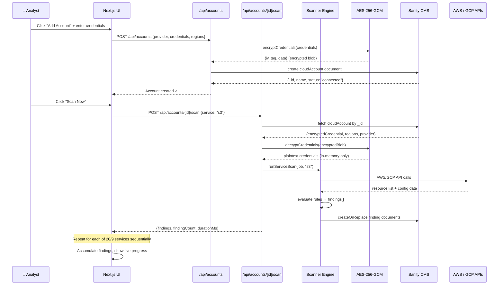
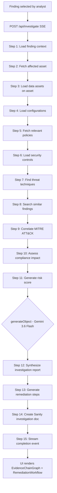
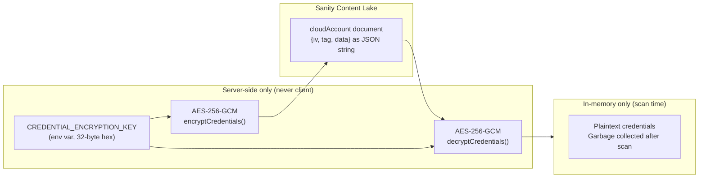
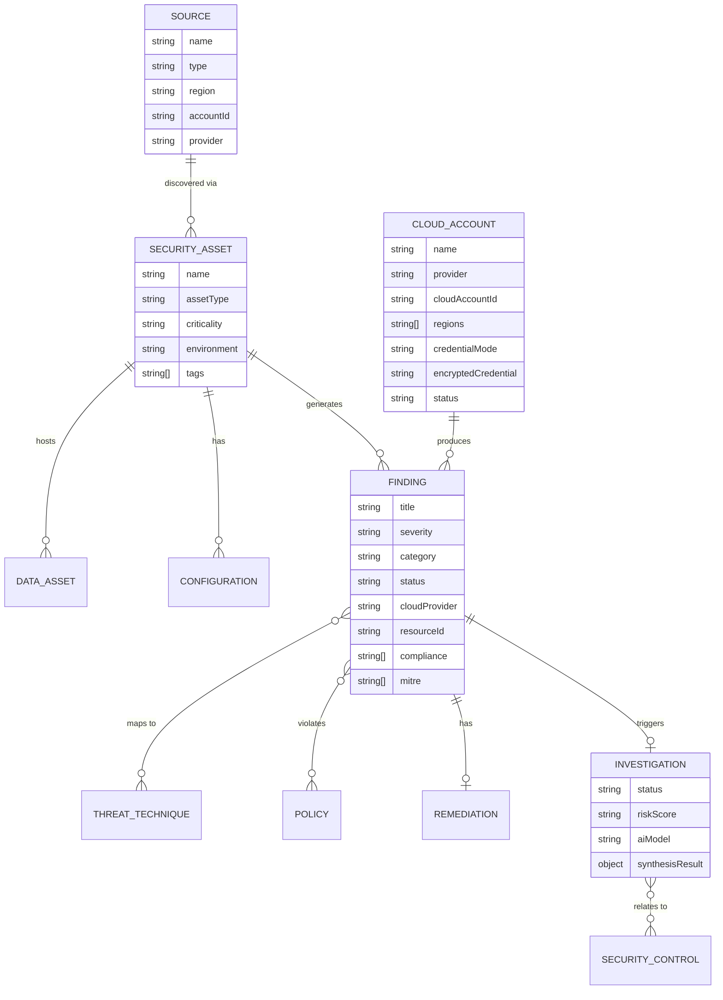
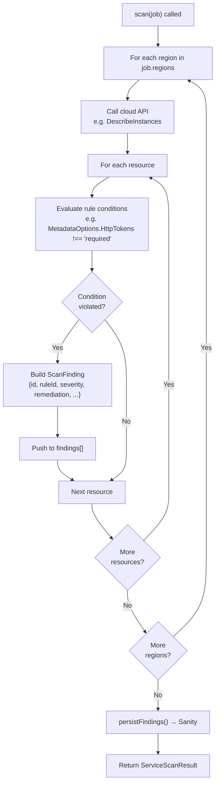

# TraceGuard — Data Flow & Scanning Reference

## Scan Data Flow (Chunked Architecture)

---

## AI Investigation Pipeline

---

## Credential Encryption Flow

**Security properties:**
- The master key **never touches Sanity** — only the encrypted blob does
- The encrypted blob uses a **fresh random 12-byte IV per encryption** — same credentials encrypted twice produce different ciphertext
- AES-256-GCM provides **authenticated encryption** — the tag prevents tampering
- Plaintext credentials exist **in Node.js process memory only** during the scan call and are garbage-collected immediately after

---

## Sanity Schema Relationships

---

## Security Rule Evaluation Logic

---

## Finding Severity Taxonomy

| Severity | Score | Examples |
|---|---|---|
| **Critical** | 9–10 | S3 public access, root access keys, SSH open to 0.0.0.0/0, RDS publicly accessible |
| **High** | 7–8 | IAM user without MFA, unencrypted EBS, Lambda with deprecated runtime, EKS public endpoint |
| **Medium** | 4–6 | S3 versioning disabled, KMS rotation disabled, VPC flow logs missing, weak password policy |
| **Low** | 1–3 | Logging configuration gaps, tagging standards |
| **Info** | 0 | Informational observations from Security Hub |

---

## Compliance Framework Coverage

| Framework | Version | Checks Covered |
|---|---|---|
| CIS AWS Foundations | v3.0 | 1.4, 1.8, 1.9, 1.10, 1.14, 1.16, 2.1.1–2.1.4, 2.2.1, 2.3.1–2.3.3, 2.4, 2.5, 2.6, 2.7, 3.1–3.3, 3.7, 3.9, 5.1–5.3, 5.6 |
| CIS GCP | v1.3 | 1.1, 1.4, 1.10, 2.1, 2.2, 3.6, 4.4, 4.9, 5.1–5.3, 6.4, 6.6, 6.7, 7.1 |
| NIST CSF | v2.0 | PR.AC-1/4/5/7, PR.DS-1/2, PR.IP-4, PR.MA-1, DE.AE-1, DE.CM-1/3, SI-2 |
| PCI DSS | v4.0 | 1.3.1/2, 3.5, 3.7, 4.2.1, 6.3.3, 6.4.1, 7.1, 8.3, 8.3.9, 8.4, 10.2/3/5/7, 11.6, 12.3.4 |
| SOC 2 | Type II | CC6.1/3/6/7, CC7.1/2, A1.2 |
| ISO 27001 | 2022 | A.9.2, A.9.4, A.12.4, A.13.1/3 |
| HIPAA | 2013 | §164.312(a)(2)(iv), §164.312(e)(1) |
| MITRE ATT&CK | v14 | T1078, T1078.004, T1133, T1190, T1021, T1530, T1552, T1557, T1562 |

---

## AWS Scanner Coverage Matrix

| Service | Scanner | Checks | Key Rules |
|---|---|---|---|
| S3 | `aws/s3.ts` | 4 | Public access block, versioning, SSE, logging |
| IAM | `aws/iam.ts` | 5 | Root keys, MFA, password policy, access key age, wildcard policies |
| EC2 | `aws/ec2.ts` | 4 | SSH/RDP open, IMDSv2, EBS encryption |
| VPC | `aws/vpc.ts` | 2 | Flow logs, default VPC |
| RDS | `aws/rds.ts` | 3 | Public access, encryption, backups |
| Lambda | `aws/lambda.ts` | 2 | Secrets in env, deprecated runtime |
| EKS | `aws/eks.ts` | 1 | Public API endpoint |
| CloudTrail | `aws/cloudtrail.ts` | 2 | Enabled + multi-region, log validation |
| KMS | `aws/kms.ts` | 1 | Key rotation |
| Secrets Manager | `aws/secretsmanager.ts` | 1 | Auto-rotation |
| ACM | `aws/acm.ts` | 1 | Expiry < 30 days |
| DynamoDB | `aws/dynamodb.ts` | 2 | KMS encryption, PITR |
| SQS | `aws/sqs.ts` | 1 | KMS encryption |
| SNS | `aws/sns.ts` | 1 | KMS encryption |
| CloudFront | `aws/cloudfront.ts` | 1 | HTTPS enforcement |
| GuardDuty | `aws/guardduty.ts` | 1 | Enabled per region |
| Security Hub | `aws/securityhub.ts` | * | All active failed findings |
| Config | `aws/config.ts` | * | Recording status + non-compliant rules |
| Redshift | `aws/redshift.ts` | 1 | Public accessibility |
| OpenSearch | `aws/opensearch.ts` | 1 | Public endpoint |

---

## GCP Scanner Coverage Matrix

| Service | Scanner | Checks | Key Rules |
|---|---|---|---|
| Cloud Storage | `gcp/gcs.ts` | 3 | Public IAM, uniform access, CMEK |
| IAM | `gcp/gcpiam.ts` | 2 | SA user-managed keys, primitive roles |
| Compute Engine | `gcp/compute.ts` | 3 | External IP, OS Login, SSH firewall |
| Cloud SQL | `gcp/cloudsql.ts` | 3 | Public IP, SSL required, backups |
| BigQuery | `gcp/bigquery.ts` | 1 | Public dataset access |
| Cloud Functions | `gcp/functions.ts` | 2 | Secrets in env, deprecated runtime |
| GKE | `gcp/gke.ts` | 2 | Public control plane, Workload Identity |
| Cloud KMS | `gcp/kms.ts` | 1 | Key rotation |
| Cloud Logging | `gcp/logging.ts` | 2 | Audit log types, log sinks |
